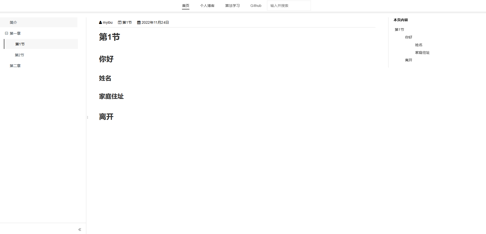

# gitbook-plugin-theme-myibu

gitbook theme plugin for myibu


## Implements

Based on jQuery and gitbook api

## Installation
```
npm i gitbook-plugin-theme-myibu
```

or config in your `book.json`

```json
{
    "plugins": [
        "theme-myibu"
    ]
}
```

## More Usage
- config top navigation menu

```json
{
  "pluginsConfig": {
    "myibuConfig": {
      "topMenus": [
        {
          "url": "XXX",
          "name": "title1"
        },
        {
          "url": "XXX",
          "name": "title2"
        },
        {
          "url": "XXX",
          "name": "title3"
        }
      ]
    }
  }
}
```

## Change Notes
### ~~0.0.8~~
- add page inner navgation
- add chapter expand
- add code

### 0.0.9
- add top navigation menu